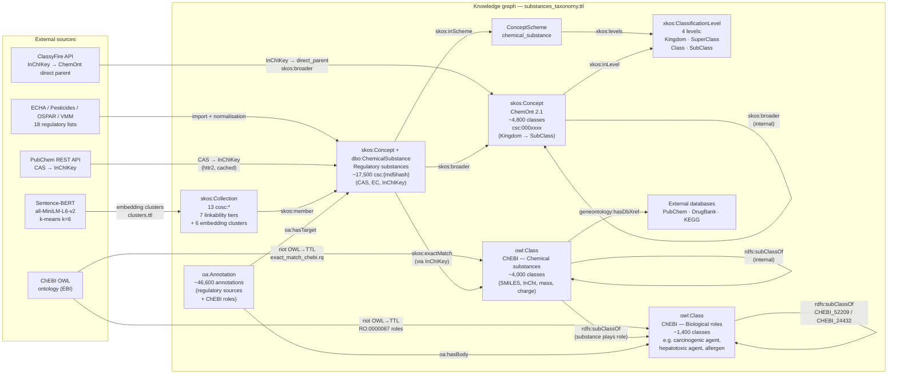

# A Substance Is Not Always a Substance

Reproducibility repository for the paper:

> **Chemical Identity Lost in Regulation: A Study of Semantic Interoperability in European Chemical Substance Data**  


## Abstract

Chemical substances are fundamental entities in environmental regulation, yet their representation in regulatory data systems diverges significantly from established practices in cheminformatics. This paper analyses interoperability challenges across European regulatory frameworks based on a case study spanning 18 datasets from the European Chemicals Agency (ECHA) and related sources.

Key findings:
- A substantial fraction of regulatory entries cannot be linked to a defined chemical structure.
- CAS numbers do not provide a reliable unique identifier across datasets.
- Semantic and embedding-based approaches fail to recover chemical identity for non-structure substances.
- Retrospective harmonisation faces combinatorial complexity that is infeasible at scale.

The paper argues that interoperability must be addressed at the level of legislation and data modelling, by adopting structure-based identifiers (InChI/InChIKey), formal ontologies, and machine-readable linked data representations.

## Repository Structure

```
R/                              Analysis pipeline (17 scripts)
bash/                           Shell scripts for RDF/SPARQL processing
data/
  source/                       Raw downloaded regulatory datasets
  cache/classyfire/             ClassyFire API response cache
  processed/
    rdf/substances_taxonomy.ttl RDF knowledge graph (substances + ChemOnt + ChEBI)
output/
  figures/                      Generated plots (PDF, one per analysis)
  tables/                       Generated tables (CSV, one per analysis)
paper/                          LaTeX source for the manuscript
```

## Analysis Pipeline

Run the full pipeline in order:

```r
source("R/run_all.R")
```

Or run individual scripts:

Scripts are listed in execution order as defined in `run_all.R`. Dependencies are noted where the order is non-obvious.

| Script | Description |
|---|---|
| `01_download.R` | Download regulatory datasets from ECHA and related sources |
| `02_import.R` | Import and harmonise raw data; resolve CAS/InChIKey via PubChem |
| `03_analysis.R` | Analyses 1–3: substance identity and identifier consistency |
| `04_entity_classification.R` | Analysis 4: entity type classification and linkability taxonomy |
| `05_overlap_lists.R` | Analysis 5: overlap between regulatory lists (UpSet plots) |
| `06_coverage_linking.R` | Analysis 6: coverage of structure-based linking per source |
| `07_network_visualisation.R` | Analysis 7: bipartite substance ↔ list network |
| `09b_chemont_model_comparison.R` | Compare embedding models (MiniLM, MPNet, SciBERT, BioBERT) for ChemOnt matching; creates cached embeddings required by `08_embedding_clustering.R` (analyses 8i/8j) |
| `08_embedding_clustering.R` | Analysis 8: sentence embedding and clustering of non-structure names (requires SciBERT/BioBERT caches from `09b`) |
| `08b_cluster_regex.R` | Analysis 8b: reverse-engineer regular expressions for embedding clusters; evaluate precision, recall, and F1 per cluster (run after `08`) |
| `09_embedding_chemont.R` | Analysis 9: cosine similarity matching to ChemOnt classes |
| `10_workload.R` | Analysis 10: pairwise group-relation workload estimation |
| `11_ambition_fte.R` | Analysis 11: FTE required to meet 2030 target |
| `12_pairwise_overlap.R` | Analysis 12: pairwise Jaccard heatmap and obligation UpSet |
| `13a_classyfire_coverage.R` | Analysis 13: ChemOnt class coverage via ClassyFire |
| `13b_before_prioritisation_create_scheme.R` | RDF schema creation; merges substance RDF with ChemOnt and ChEBI; produces `substances_taxonomy_levels.ttl` (prerequisite for `09c` and `14`) |
| `09c_chemont_model_validation.R` | Analysis 9c: validate ChemOnt embedding matching against ground truth derived from ClassyFire-classified substances (requires `substances_taxonomy_levels.ttl` from `13b`) |
| `14_prioritization.R` | Analysis 14: composite priority scoring and visualisations |

## Data Sources

Regulatory datasets downloaded by `R/01_download.R`:

### ECHA — Obligation Lists (`chem.echa.europa.eu/obligation-lists/`)

| List | URL | Source file |
|---|---|---|
| Candidate List of SVHCs for Authorisation (legacy portal) | https://echa.europa.eu/nl/candidate-list-table | `candidate-list-of-svhc-for-authorisation-export.csv` |
| Candidate List | https://chem.echa.europa.eu/obligation-lists/candidateList | `candidate_list_full.xlsx` |
| Authorisation List | https://chem.echa.europa.eu/obligation-lists/authorisationList | `authorisation_list_full.xlsx` |
| Restriction List | https://chem.echa.europa.eu/obligation-lists/restrictionList | `restriction_list_full.xlsx` |
| POPs List | https://chem.echa.europa.eu/obligation-lists/popsList | `pops_list_full.xlsx` |
| EU Positive List | https://chem.echa.europa.eu/obligation-lists/euPositiveList | `eu_positive_list_full.xlsx` |
| CLH List (Harmonised Classification and Labelling) | https://chem.echa.europa.eu/obligation-lists/clhList | `Harmonised_List.xlsx` |

### ECHA — Activity Lists (`chem.echa.europa.eu/activity-lists/`)

| List | URL | Source file |
|---|---|---|
| Restriction Process | https://chem.echa.europa.eu/activity-lists/restrictionProcess | `restriction_process_full.xlsx` |
| SVHC Identification | https://chem.echa.europa.eu/activity-lists/svhcIdentification | `svhc_identification_full.xlsx` |
| Authorisation Process | https://chem.echa.europa.eu/activity-lists/authorisationProcess | `authorisation_process_full.xlsx` |
| Dossier Evaluation | https://chem.echa.europa.eu/activity-lists/dossierEvaluation | `dossier_evaluation_full.xlsx` |
| CLH Process | https://chem.echa.europa.eu/activity-lists/clhProcess | `clh_process_full.xlsx` |
| Substance Evaluation | https://chem.echa.europa.eu/activity-lists/substanceEvaluation | `substance_evaluation_full.xlsx` |
| POPs Process | https://chem.echa.europa.eu/activity-lists/popsProcess | `pops_process_full.xlsx` |
| PBT Assessment | https://chem.echa.europa.eu/activity-lists/pbtAssessment | `pbt_assessment.xlsx` |
| ED Assessment | https://chem.echa.europa.eu/activity-lists/edAssessment | `ed_assessment.xlsx` |

### Other Sources

| Source | List                                                                              | URL | Source file |
|---|-----------------------------------------------------------------------------------|---|---|
| ECHA | REACH Registrations                                                               | https://chem.echa.europa.eu/ | `reach_registrations.xlsx` |
| EU Pesticides Database | Active Substances                                                                 | https://ec.europa.eu/food/plant/pesticides/eu-pesticides-database/start/screen/active-substances | `Pesticides_ActiveSubstanceExport.xlsx` |
| OSPAR | List of Chemicals for Priority Action                                             | https://www.ospar.org/work-areas/hasec/hazardous-substances/priority-action | `04-12e_agreement_list_of_chemicals_for_priority_action_update_2023-24.pdf` |
| Flemish Government | Substance list (sommatie stoffen) created in the context of a water quality model | https://datasets.omgeving.vlaanderen.be/be.vlaanderen.omgeving.data.id.distribution.codelijst-sommatie_stoffen.3.0.8.sommatie_stoffen.csv | `sommatie_stoffen.rds` |

## Bash Scripts (RDF/SPARQL Pipeline)

The `bash/` directory contains shell scripts that build and enrich the RDF knowledge graph. They depend on [Apache Jena](https://jena.apache.org/) (`riot`, `sparql`) being installed (tested with Jena 5.6.0 at `/opt/apache-jena-5.6.0/`).

| Script | Description |
|---|---|
| `get_source_lists.sh` | Download regulatory substance lists from ECHA via curl |
| `jsonld-to-ttl.bash` | Convert ClassyFire JSON-LD output to Turtle using `riot` |
| `merge.bash` | Merge substance RDF with ChemOnt SKOS; apply XKOS relations; produce `substances_taxonomy.ttl` |
| `chebi.sh` | Download ChEBI OWL, convert to Turtle, match substances by InChIKey, and annotate with biological hazard data |
| `01_chemont_obo_to_owl.sh` | Convert ChemOnt OBO to OWL using [ROBOT](https://robot.obolibrary.org/) |

SPARQL query files (`.rq`) in `bash/` are used by the scripts above:

| Query | Description                                                                                                         |
|---|---------------------------------------------------------------------------------------------------------------------|
| `merge.rq` | Assign ChemOnt classes to substances via InChIKey                                                                   |
| `chemont_to_xkos.rq` | Express ChemOnt hierarchy as XKOS classification levels                                                             |
| `chemont_to_skos.rq` / `chemont_to_table.rq` | Express ChemOnt subClass hierarchy as SKOS broader/narrower relations, filter on relevant parent groups  / flat CSV |
| `exact_match_chebi.rq` | Match substances to ChEBI entities via `skos:exactMatch`                                                            |
| `chebi_annotaties.rq` / `chebi_to_table.rq` | Express ChEBI hazard annotations, as W3C oa:Annotations                                                             |
| `inverse.rq` | Add inverse SKOS relations                                                                                          |

### Knowledge Graph

The central output of the RDF pipeline is `data/processed/rdf/substances_taxonomy.ttl`, a Turtle file that integrates:
- All regulatory substance entries with their identifiers
- ChemOnt chemical taxonomy (via ClassyFire classification)
- ChEBI biological hazard annotations (via InChIKey exact match)
- Cluster and linkability annotations from the R pipeline

This file is the input for the priority scoring in `R/14_prioritization.R`.



## Outputs

After running the full pipeline, results are written to:

- **`output/figures/`** — one PDF per analysis (e.g. `Analysis_1_What_is_a_substance.pdf`, `Analysis_14e_Bubble_priority.pdf`)
- **`output/tables/`** — one CSV per analysis (e.g. `Analysis_1_structure_vs_nonstructure.csv`, `Analysis_14a_top50.csv`)
- **`data/processed/rdf/substances_taxonomy.ttl`** — the merged RDF knowledge graph

## Dependencies

### R packages

The pipeline uses `here`, `httr2`, `tidyverse`, and additional packages for embeddings, network analysis, RDF serialisation, and visualisation. Install missing packages as prompted.

### ClassyFire

Chemical taxonomy classification is retrieved from the ClassyFire API. Responses are cached in `data/cache/classyfire/` to avoid redundant requests.

### Apache Jena

The bash scripts require Apache Jena 5.6.0 installed at `/opt/apache-jena-5.6.0/`. Adjust paths in the scripts if your installation differs.

### Sentence embeddings (GPU)

Scripts `08_embedding_clustering.R`, `09_embedding_chemont.R`, `09b_chemont_model_comparison.R`, and `09c_chemont_model_validation.R` compute sentence embeddings via the `sentence-transformers` Python library, called from R through `reticulate`. Embeddings are cached to disk after the first run; subsequent runs reuse the cache.

**NVIDIA driver and CUDA**

| Component | Version |
|---|---|
| NVIDIA driver | 580.126.09 |
| CUDA (driver level) | 13.0 |

Verify with:
```bash
nvidia-smi
```

**Python environment**

This project uses a `reticulate`-managed `uv` environment. Install the CUDA variant of PyTorch into it as follows (adjust `cu130` to match the CUDA version reported by `nvidia-smi`):

```bash
~/.cache/R/reticulate/uv/bin/uv pip install torch \
  --index-url https://download.pytorch.org/whl/cu130 \
  --python ~/.cache/R/reticulate/uv/cache/archive-v0/Ki1QH51N4jeG6c5pJ9hTD/bin/python
```

| CUDA version (`nvidia-smi`) | index URL |
|---|---|
| 12.1 | `https://download.pytorch.org/whl/cu121` |
| 12.4 | `https://download.pytorch.org/whl/cu124` |
| 13.0 | `https://download.pytorch.org/whl/cu130` |

| Package | Version |
|---|---|
| torch | 2.11.0+cu130 |
| sentence-transformers | 5.4.0 |

**R packages**

```r
install.packages("reticulate")
```

`reticulate` manages its own Python environment via `uv`. See [`docs/gpu_cuda_setup.md`](docs/gpu_cuda_setup.md) for the full setup procedure, including driver installation and verification steps.

**Models used**

| Model | HuggingFace ID | Dimensions |
|---|---|---|
| MiniLM | `all-MiniLM-L6-v2` | 384 |
| MPNet | `all-mpnet-base-v2` | 768 |
| SciBERT | `allenai/scibert_scivocab_uncased` | 768 |
| BioBERT | `dmis-lab/biobert-v1.1` | 768 |

Models are downloaded automatically from HuggingFace on first use and cached locally by `sentence-transformers`.

## Paper

The manuscript source is in `paper/`. See [`paper/README.md`](paper/README.md) for build instructions (requires TinyTeX and the LaTeX Workshop VS Code extension).

```bash
./paper/scripts/build_pdf.sh
```

## License

See [LICENSE](LICENSE).
