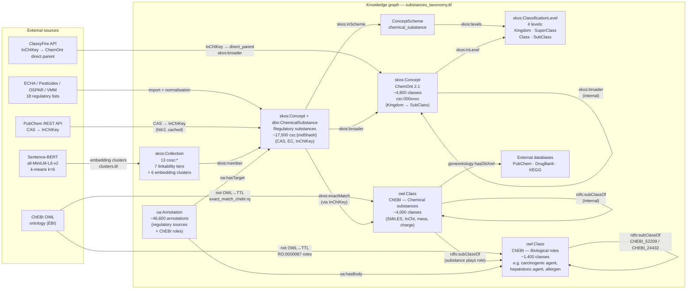

```mermaid
graph LR
  subgraph ext["External sources"]
    ECHA["ECHA / Pesticides / OSPAR / VMM\n18 regulatory lists"]
    PubChem["PubChem REST API\nCAS → InChIKey"]
    ClassyFire_src["ClassyFire API\nInChIKey → ChemOnt direct parent"]
    ChEBI_src["ChEBI OWL\nontology (EBI)"]
    BERT["Sentence-BERT\nall-MiniLM-L6-v2\nk-means k=6"]
  end

  subgraph kg["Knowledge graph — substances_taxonomy.ttl"]
    Scheme["ConceptScheme\nchemical_substance"]

    Substances["skos:Concept + dbo:ChemicalSubstance\nRegulatory substances\n~17,500 csc:{md5hash}\n(CAS, EC, InChIKey)"]

    ChemOnt["skos:Concept\nChemOnt 2.1\n~4,800 classes\ncsc:000xxxx\n(Kingdom → SubClass)"]

    XKOS["xkos:ClassificationLevel\n4 levels:\nKingdom · SuperClass\nClass · SubClass"]

    Collections["skos:Collection\n13 cosc:*\n7 linkability tiers\n+ 6 embedding clusters"]

    ChEBI_stof["owl:Class\nChEBI — Chemical substances\n~4,000 classes\n(SMILES, InChI, mass, charge)"]

    ChEBI_rol["owl:Class\nChEBI — Biological roles\n~1,400 classes\ne.g. carcinogenic agent,\nhepatotoxic agent, allergen"]

    Annotations["oa:Annotation\n~46,600 annotations\n(regulatory sources\n+ ChEBI roles)"]

    ExtDB["External databases\nPubChem · DrugBank · KEGG"]
  end

  %% External sources → knowledge graph
  ECHA -->|"import + normalisation"| Substances
  PubChem -->|"CAS → InChIKey\n(httr2, cached)"| Substances
  ClassyFire_src -->|"InChIKey → direct_parent\nskos:broader"| ChemOnt
  ChEBI_src -->|"riot OWL→TTL\nexact_match_chebi.rq"| ChEBI_stof
  ChEBI_src -->|"riot OWL→TTL\nRO:0000087 roles"| ChEBI_rol
  BERT -->|"embedding clusters\nclusters.ttl"| Collections

  %% Within the knowledge graph
  Substances -->|"skos:inScheme"| Scheme
  Substances -->|"skos:broader"| ChemOnt
  Substances -->|"skos:exactMatch\n(via InChIKey)"| ChEBI_stof
  Collections -->|"skos:member"| Substances
  ChemOnt -->|"skos:broader\n(internal)"| ChemOnt
  Scheme -->|"xkos:levels"| XKOS
  ChemOnt -->|"xkos:inLevel"| XKOS
  ChEBI_stof -->|"rdfs:subClassOf\n(internal)"| ChEBI_stof
  ChEBI_stof -->|"rdfs:subClassOf\n(substance plays role)"| ChEBI_rol
  ChEBI_rol -->|"rdfs:subClassOf\nCHEBI_52209 / CHEBI_24432"| ChEBI_rol
  ChEBI_stof -->|"geneontology:hasDbXref"| ExtDB
  Annotations -->|"oa:hasTarget"| Substances
  Annotations -->|"oa:hasBody"| ChEBI_rol
```
